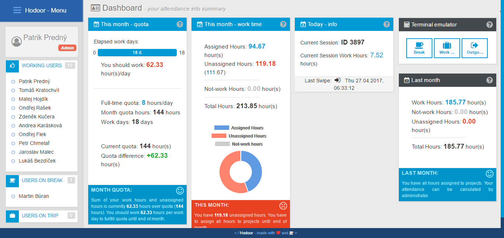
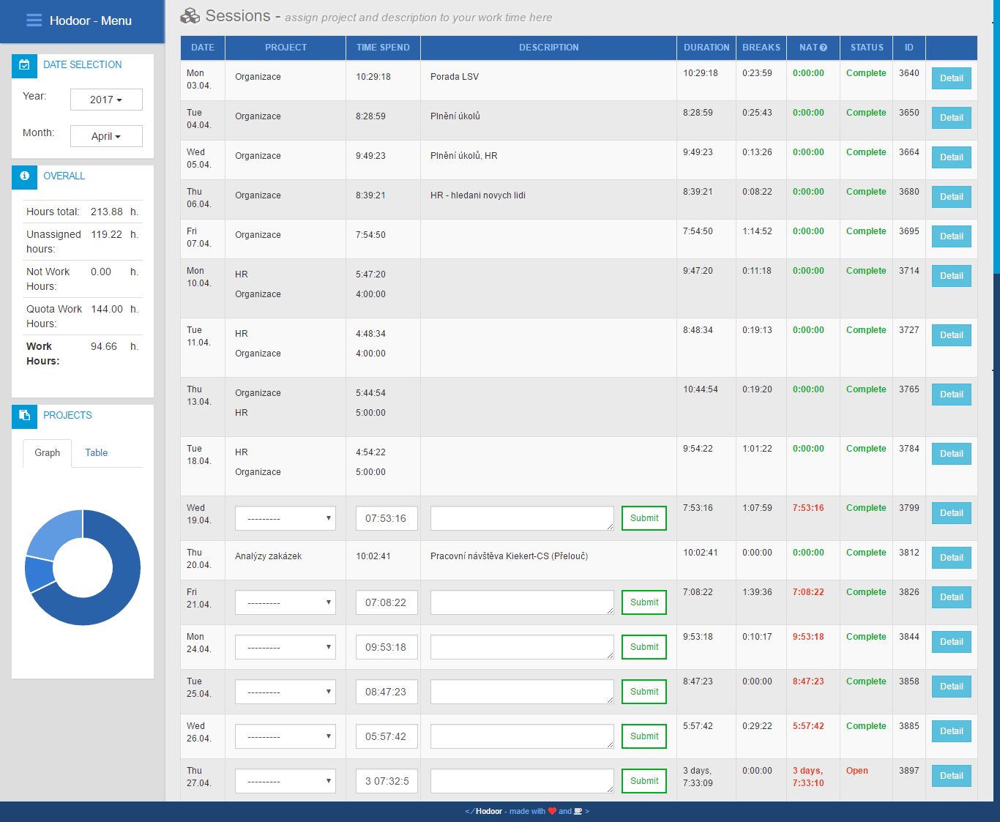

[](https://travis-ci.org/hodooor/Hodoor)

Hodoor is casual attendance system. It is built for small to medium sized companies and teams, who don't need strict access control, but want to measure time spend on projects and/or at work.
Hodoor was developed, because my company [ELEDUS](http://www.eledus.cz/) needed such system and commercially available systems didn't met  our requirements (and I also wanted to learn Django). We wanted highly customized solution with nice features.Now we decided to open source it. Some features are not realy general / configurable, but we will work on it - be patient please :)

# Overview
Hoodor is Django Web Application with REST API, which can be accessed from clients or directly controlled via web interface. We are using our [Electron](http://electron.atom.io/) application (will be available soon) on Raspberry Pi with RFID scanner as front end.

What can Hodoor do:
* Record single actions (Swipes)
* Insert Swipes into Sessions (Workdays)
* Measure Sessions time
* Assign Session time into projects
* Calculate Month statistics for Users
* Calculate Month Statistics of all users for Admins
* Can be accessed via REST API
* Can be accessed directly by web interface
* Can show Users at work / on break

# Development
You need Python 3.4+ and probably [virtual enviroment](https://virtualenv.pypa.io/en/stable/) (if you have more python projects on your machine). You also need [npm](https://www.npmjs.com/) to install dependencies.
When using ubuntu you may need to install nodejs-legacy. Run `sudo apt install nodejs-legacy` and then install npm dependencies. When using windows you need to manually copy "node_modules" folder from nodejs installation folder to project folder.

You should create similar folder structure:
```
[Project Folder]
    [repo]
    [virtualenv]
    [database]
    [static]
```
*repo* folder is  this cloned repo. Relative path from *repo* to *database* is important even in development enviroment. *static* folder will be created after you run `python manage.py collectstatic` (it is not required for development purposes). *virtualenv* can be enywhere as long as you activate it.

If you have prepared folder structure and activated virutalenv you can:
```
cd repo
pip install -r requirements.txt
npm install
python manage.py migrate
python manage.py runserver
```
Then you should be able to access page at `http://localhost:8000/`
You can create superuser by running:
```
python manage.py createsuperuser
```
 
# Server deployment
Deployment process was inspired by great book [Test-Driven Web Development with Python](http://chimera.labs.oreilly.com/books/1234000000754/ch08.html) - Chapter8 and Chapter 9. I'm using apache2 instead of Nginx. You can use template [config file](deploy_tools/apache.conf.template) for apache2 https access with self-signed certificate.

Deployment process was automated by [Fabric](http://www.fabfile.org/) - [fabfile](deploy_tools/fabfile.py). You need python2 to be able to run fab script. After webserver configuration, deployment of new version should be as easy as:
```
cd deploy_tools
fab deploy:host=USERNAME@site.address.com
```
For more information and step by step process, please use [Test-Driven Web Development with Python](http://chimera.labs.oreilly.com/books/1234000000754/ch08.html)  

# License
Project is licenced under GNU GPLv3 License
# Screenshots
Profile page

Sessions

